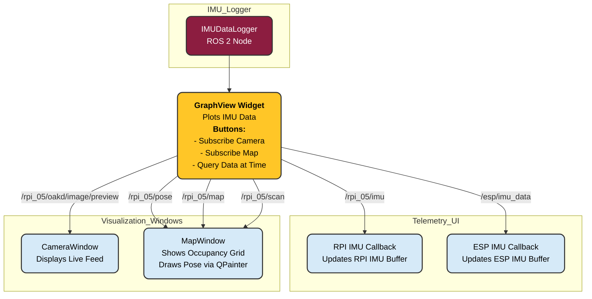

```mermaid
    graph TD

    %% IMU Logger
    subgraph IMU_Logger
        A[IMUDataLogger<br>ROS 2 Node]
    end

    B[<b>GraphView Widget</b><br>Plots IMU Data<br><b>Buttons:</b><br>- Subscribe Camera<br>- Subscribe Map<br>- Query Data at Time]
    
    %% Graph View + Telemetry Subscriptions
    subgraph Telemetry_UI
        C[RPI IMU Callback<br>Updates RPI IMU Buffer]
        D[ESP IMU Callback<br>Updates ESP IMU Buffer]
    end
    
    %% Camera and Map Windows
    subgraph Visualization_Windows
        E[CameraWindow<br>Displays Live Feed]
        F[MapWindow<br>Shows Occupancy Grid<br>Draws Pose via QPainter]
    end
    
    %% Connections
    A --> B
    B -->|/rpi_05/imu| C
    B -->|/esp/imu_data| D
    B -->|/rpi_05/oakd/image/preview| E
    B --> |/rpi_05/pose| F
    B --> |/rpi_05/map| F
    B --> |/rpi_05/scan| F
    
    %% Styles
    style A fill:#8C1D40,stroke:#333,stroke-width:2px,color:#FFFFFF,rx:10,ry:10
    style B fill:#FFC627,stroke:#333,stroke-width:2px,color:#000,rx:10,ry:10
    style C fill:#D6EAF8,stroke:#333,stroke-width:2px,color:#000,rx:10,ry:10
    style D fill:#D6EAF8,stroke:#333,stroke-width:2px,color:#000,rx:10,ry:10
    style E fill:#D6EAF8,stroke:#333,stroke-width:2px,color:#000,rx:10,ry:10
    style F fill:#D6EAF8,stroke:#333,stroke-width:2px,color:#000,rx:10,ry:10

```