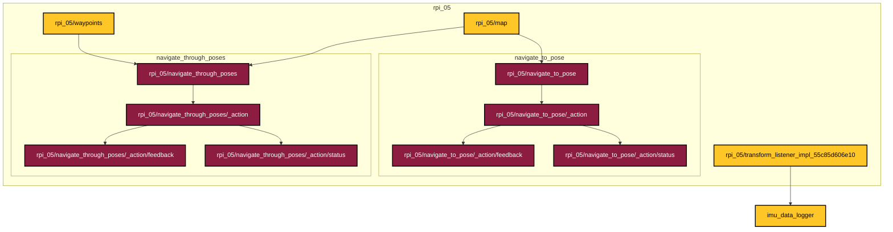

```mermaid
graph TD

%% Color Classes
classDef asuGold fill:#FFC627,stroke:#000000,stroke-width:2px,color:#000000;
classDef asuMaroon fill:#8C1D40,stroke:#000000,stroke-width:2px,color:#FFFFFF;
classDef clusterStyle fill:#f2f2f2,stroke:#333,stroke-width:1px;

%% Outer Cluster for rpi_05 Node
subgraph rpi_05
    class rpi_05 clusterStyle;

    %% navigate_to_pose cluster
    subgraph navigate_to_pose
        class navigate_to_pose clusterStyle;

        A1[rpi_05/navigate_to_pose]
        A2[rpi_05/navigate_to_pose/_action]
        A3[rpi_05/navigate_to_pose/_action/feedback]
        A4[rpi_05/navigate_to_pose/_action/status]

        A1 --> A2
        A2 --> A3
        A2 --> A4

        class A1,A2,A3,A4 asuMaroon;
    end

    %% navigate_through_poses cluster
    subgraph navigate_through_poses
        class navigate_through_poses clusterStyle;

        B1[rpi_05/navigate_through_poses]
        B2[rpi_05/navigate_through_poses/_action]
        B3[rpi_05/navigate_through_poses/_action/feedback]
        B4[rpi_05/navigate_through_poses/_action/status]

        B1 --> B2
        B2 --> B3
        B2 --> B4

        class B1,B2,B3,B4 asuMaroon;
    end

    %% Standalone Topics
    C1[rpi_05/waypoints]
    C2[rpi_05/map]
    D[rpi_05/transform_listener_impl_55c85d606e10]
    class C1,C2 asuGold;

    %% Inferred useful connections
    C1 --> B1
    C2 --> A1
    C2 --> B1
end

%% External Connections
E[imu_data_logger]

D --> E

class D,E asuGold;

```