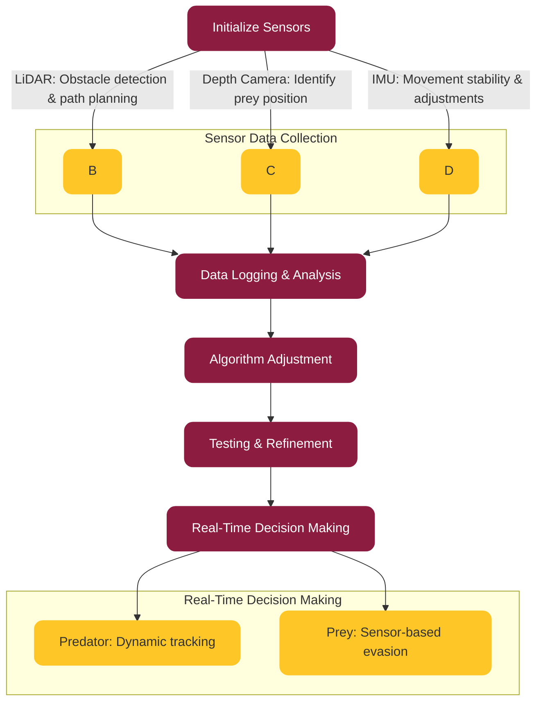

```mermaid
graph TD;
    A[Initialize Sensors] -->|LiDAR: Obstacle detection & path planning| B
    A -->|Depth Camera: Identify prey position| C
    A -->|IMU: Movement stability & adjustments| D
    B --> E[Data Logging & Analysis]
    C --> E
    D --> E
    E --> F[Algorithm Adjustment]
    F --> G[Testing & Refinement]
    G --> H[Real-Time Decision Making]

    subgraph "Sensor Data Collection"
        B
        C
        D
    end

    subgraph "Real-Time Decision Making"
        H1[Predator: Dynamic tracking]
        H2[Prey: Sensor-based evasion]
    end

    H --> H1
    H --> H2

    style A fill:#8C1D40,stroke:#8C1D40,stroke-width:2px,color:#FFFFFF,rx:10,ry:10;
    style B fill:#FFC627,stroke:#FFC627,stroke-width:2px,color:#333333,rx:10,ry:10;
    style C fill:#FFC627,stroke:#FFC627,stroke-width:2px,color:#333333,rx:10,ry:10;
    style D fill:#FFC627,stroke:#FFC627,stroke-width:2px,color:#333333,rx:10,ry:10;
    style E fill:#8C1D40,stroke:#8C1D40,stroke-width:2px,color:#FFFFFF,rx:10,ry:10;
    style F fill:#8C1D40,stroke:#8C1D40,stroke-width:2px,color:#FFFFFF,rx:10,ry:10;
    style G fill:#8C1D40,stroke:#8C1D40,stroke-width:2px,color:#FFFFFF,rx:10,ry:10;
    style H fill:#8C1D40,stroke:#8C1D40,stroke-width:2px,color:#FFFFFF,rx:10,ry:10;
    style H1 fill:#FFC627,stroke:#FFC627,stroke-width:2px,color:#333333,rx:10,ry:10;
    style H2 fill:#FFC627,stroke:#FFC627,stroke-width:2px,color:#333333,rx:10,ry:10;
```
