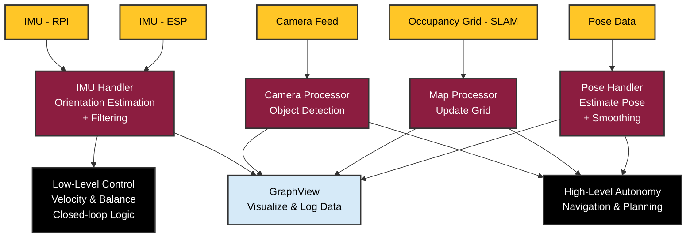

```mermaid
graph TD

%% Sensor Inputs
A1[IMU - RPI]
A2[IMU - ESP]
A3[Camera Feed]
A4[Occupancy Grid - SLAM]
A5[Pose Data]

%% Data Processing
B1[IMU Handler<br>Orientation Estimation<br>+ Filtering]
B2[Camera Processor<br>Object Detection]
B3[Map Processor<br>Update Grid]
B4[Pose Handler<br>Estimate Pose<br>+ Smoothing]

%% Control Layers
C1[Low-Level Control<br>Velocity & Balance<br>Closed-loop Logic]
C2[High-Level Autonomy<br>Navigation & Planning]

%% Data Logging
D1[GraphView<br>Visualize & Log Data]

%% Connections
A1 --> B1
A2 --> B1
A3 --> B2
A4 --> B3
A5 --> B4

B1 --> C1
B2 --> C2
B3 --> C2
B4 --> C2

B1 --> D1
B2 --> D1
B3 --> D1
B4 --> D1

%% Styles
style A1 fill:#FFC627,stroke:#333,stroke-width:2px,color:#000
style A2 fill:#FFC627,stroke:#333,stroke-width:2px,color:#000
style A3 fill:#FFC627,stroke:#333,stroke-width:2px,color:#000
style A4 fill:#FFC627,stroke:#333,stroke-width:2px,color:#000
style A5 fill:#FFC627,stroke:#333,stroke-width:2px,color:#000

style B1 fill:#8C1D40,stroke:#333,stroke-width:2px,color:#fff
style B2 fill:#8C1D40,stroke:#333,stroke-width:2px,color:#fff
style B3 fill:#8C1D40,stroke:#333,stroke-width:2px,color:#fff
style B4 fill:#8C1D40,stroke:#333,stroke-width:2px,color:#fff

style C1 fill:#000000,stroke:#333,stroke-width:2px,color:#fff
style C2 fill:#000000,stroke:#333,stroke-width:2px,color:#fff

style D1 fill:#D6EAF8,stroke:#333,stroke-width:2px,color:#000

```